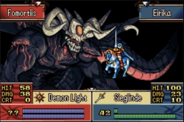
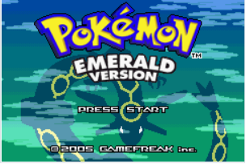

## About
A Game Boy Advance emulator, written in javascript.

## Usage
This project is hosted on Github at [https://samuelchen52.github.io/gbaemu/](https://samuelchen52.github.io/gbaemu/). To use, just select your desired GBA rom. You can also select a BIOS file beforehand, though this is optional and if not provided the [BIOS](https://github.com/Nebuleon/ReGBA/blob/master/bios/gba_bios.bin) file by [Normatt](https://github.com/Normmatt/gba_bios) will be used, or play around with a demo rom from [TONC](https://www.coranac.com/projects/#tonc) by clicking on the demo button.

## Screenshots
The classic GBA BIOS boot screen

Some gameplay from Fire Emblem Sacred Stones

Obligatory screenshot of the Pokemon Emerald start screen

## Current State
So far, only the timers and graphics are in a (near) complete state. There is still quite a bit of work to be done with the other GBA components (outlined in the next section). However, the games I have tried are booting up and running just fine (Pokemon Ruby/Sapphire/Emerald/Leafgreen/Firered, Fire Emblem Sacred Stones, Kirby NMD, and Mega Man Battle Network 6). 

## Planned Improvements / Features
* Semi-accurate CPU timings
* Optimizations for greater speed
* Savestates / Savegames
* Better UI
* Sound
* Tests

## Credit
[TONC](https://www.coranac.com/tonc/text/toc.htm) - very helpful write-up on the internals of GBA hardware

[GBATEK](https://problemkaputt.de/gbatek.htm) - reference sheet for GBA hardware

[No$gba](https://problemkaputt.de/gba.htm) / [mGBA](https://mgba.io/downloads.html) - established GBA emulators that were used for debugging

[Near / Talarubi](https://byuu.net/video/color-emulation/) - color correction